# Pipeline Crypto — CoinGecko → S3 → Glue → Redshift

Pipeline batch de engenharia de dados que extrai cotações de criptomoedas da API pública do [CoinGecko](https://www.coingecko.com/), processa em arquitetura medalhão na AWS, e entrega um modelo dimensional pronto para consulta analítica no Redshift.

Projeto de estudo — o objetivo é praticar o pipeline de ponta a ponta (containerização, deploy em nuvem, transformação, modelagem, orquestração), não construir um produto de monitoramento de mercado.

## Arquitetura

```mermaid
flowchart LR
    API[API CoinGecko]

    subgraph EC2["Instância EC2 (efêmera — liga, roda, desliga)"]
        Container["Container Docker<br/>extract_data.py"]
    end

    S3B[("S3 — bronze/<br/>JSON bruto, timestampado")]
    Glue["AWS Glue<br/>Python Shell<br/>(limpeza + normalização)"]
    S3S[("S3 — silver/<br/>Parquet particionado por data")]
    Redshift[("Redshift Serverless<br/>star schema (gold)")]
    Queries["Queries analíticas"]

    API -->|requests + retry/backoff| Container
    Container -->|boto3 put_object<br/>direto da memória| S3B
    S3B --> Glue
    Glue -->|awswrangler to_parquet| S3S
    S3S -->|COPY| Staging["stg_precos"]
    Staging -->|INSERT SELECT| Redshift
    Redshift --> Queries
```



**Orquestração (Airflow):** planejada, mas adiada. Subir o stack completo (webserver + scheduler + Postgres + Redis) via Docker Compose se mostrou pesado demais para o hardware disponível localmente e chegou a travar a máquina duas vezes. A decisão foi não insistir num ambiente que não aguenta a carga — o próximo passo, se retomado, é rodar o Airflow numa instância com mais recursos (EC2 dedicada) em vez de localmente.

## Stack

| Camada | Ferramenta | Papel |
|---|---|---|
| Extração | Python + `requests`, Docker | consulta a API, respeita rate limit com backoff exponencial |
| Compute | EC2 (t2.micro/t3.micro) | roda o container só durante a extração; sem Elastic IP, desligada após uso |
| Armazenamento raw | S3 (bronze) | JSON bruto, fiel à resposta da API |
| Transformação | AWS Glue — Python Shell | limpeza, normalização, conversão para Parquet |
| Armazenamento tratado | S3 (silver) | Parquet particionado por `dt_extracao` |
| Modelagem/consulta | Redshift Serverless | star schema: `fato_precos`, `dim_moeda`, `dim_data` |
| Credenciais AWS | IAM Role anexada à EC2 | nenhuma chave de acesso é gravada em disco ou em variável de ambiente |

## Por que essas escolhas

- **Glue Python Shell, não Spark**: o volume de dados (5 moedas, execuções diárias) não justifica um cluster Spark. Python Shell roda scripts leves sem provisionar cluster, com custo em DPU muito menor.
- **`boto3.put_object` em vez de gravar em disco**: o container na EC2 é efêmero — qualquer arquivo salvo localmente morre junto com ele. O script extrai e envia para o S3 na mesma execução, direto da memória, sem nunca tocar disco.
- **IAM Role em vez de chaves de acesso**: a EC2 já nasce autorizada a escrever no bucket; o script nunca precisa carregar nem gerenciar credenciais.
- **`overwrite_partitions` por dia**: a regra de negócio é uma extração por dia. Cada execução sobrescreve apenas a partição do dia corrente, sem tocar no histórico de dias anteriores — idempotência simples e segura para esse cenário. (Se a frequência mudasse para múltiplas execuções por dia, a estratégia precisaria virar `append` com deduplicação a jusante, via `ROW_NUMBER()` no Redshift.)
- **Staging table antes das dimensões/fato**: um único Parquet na silver alimenta três tabelas na gold. O padrão ELT clássico usa uma tabela espelho (`stg_precos`) como intermediária do `COPY`, e depois popula dimensões e fato via `INSERT INTO ... SELECT`.

## Um bug real, documentado

Durante o desenvolvimento local (extração containerizada), toda chamada à API falhava com erro de certificado SSL, mesmo após instalar/atualizar `ca-certificates` no container. O diagnóstico, feito por eliminação sistemática (testando com `curl`, depois `openssl s_client`, depois trocando de rede), revelou que a rede da universidade usa um firewall Fortinet fazendo inspeção de tráfego HTTPS — ele intercepta a conexão e apresenta um certificado próprio no lugar do certificado real do domínio. O problema nunca teve relação com o container, o Docker ou o código: era interceptação de rede, resolvida trocando de rede (ou, alternativamente, registrando o certificado do Fortinet como confiável no container).

## Estrutura do repositório

```
pipeline-crypto/
├── src/
│   └── extract_data.py       # extração + upload direto ao S3
├── glue/
│   └── transform_glue.py     # bronze → silver
├── sql/
│   ├── redshift_ddl.sql      # criação do schema/tabelas
│   ├── variacao_percentual.sql
│   ├── ranking_volume.sql
│   └── comparacao_moedas.sql
├── Dockerfile
├── requirements.txt
└── .gitignore
```

## Queries analíticas

| Query | O que responde |
|---|---|
| `sql/variacao_percentual.sql` | variação percentual do preço de cada moeda em relação à execução anterior (usa `LAG()` particionado por moeda) |
| `sql/ranking_volume.sql` | ranking de moedas por volume de negociação em um dia específico |
| `sql/comparacao_moedas.sql` | preço, volume e market cap de múltiplas moedas lado a lado ao longo do período coletado |

## Status

- [x] Setup de ambiente e credenciais
- [x] Extração containerizada (Docker + retry + rate limit)
- [x] Deploy na EC2
- [x] Transformação bronze → silver (Glue)
- [x] Modelagem dimensional + carga na gold (Redshift)
- [x] Queries de validação analítica
- [ ] Orquestração com Airflow — adiada por restrição de hardware local; retomar em ambiente na nuvem